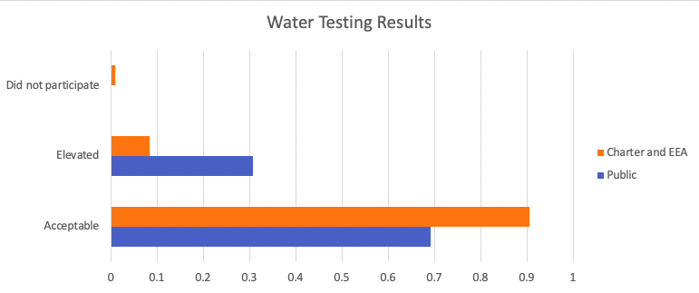

# Suggested Agenda
| Item | Duration (min) |
| :- | :- |
| Icebreaker/Intros   - Name   - Department/Affilitation   - What is your favoriate online data science resource? | 5 |
| Read Through Instructions (Below) | 5 |
| Complete Task | 15 |
| Assign Presenter (for report-out) | 5 |

# Plotting 2016 Water Testing Results for Detroit Schools
In 2016, as a response to the [Flint Water Crisis](https://en.wikipedia.org/wiki/Flint_water_crisis), the [Detroit's Public School District](https://www.detroitnews.com/story/news/local/detroit-city/2016/04/05/detroit-schools-dps-lead-copper-testing/82679668/) conducted water testing  for lead. These tests were conducted in both Public and Charter schools, and you can access the results in Detroit's Open Data Portal.
- [Public School Results](https://data.detroitmi.gov/datasets/dps-water-testing-results/explore)
- [Charter School Results](https://data.detroitmi.gov/datasets/charter-and-eea-schools-water-testing-results/explore)

Suppose you were trying to create a single data visualization to compare the water testing results in Public and Charter schools (see sample below). 

Right now, you are able to create two separate visualizations; one for just public schools and another for just charter schools (see in challenge starter). **You are having trouble combining the two visualizations into a single plot like the one above.**

## Your Task
In this challenge, you'll apply what you've learned about Finding Data Science Help Online. You will search online resources that answer your question (how to combine the two visualizations into one). As you are searching, answer the questions below:
- How did you phrase your data science question while searching?
- List the online resources (URLs) you used to answer your data science question (if any)
- If you did not find any online resources that adequately addressed your question, compose a complete forum post and state where (in which online forum) you would post.
You may not directly use the plot above in your post (however, you may draw or create something similar 😉)

# Challenge Starters
You can complete this challenge in either Excel, R, or Python. Choose ONE of the formats below and download the contents to begin this challenge (whichever format you are most comfortable with).
- [Excel](https://ucsf.box.com/s/wzjrw6n3kocunrfyle9n6tshuxufncpa)
- [R (RStudio)](https://ucsf.box.com/s/4zwsedlrdg5s2n3tmiv7diape24iizfc)
- [Python (Jupyter)](https://ucsf.box.com/s/pfjffewsqjl4zplryi1wehi9del8dzoc)
